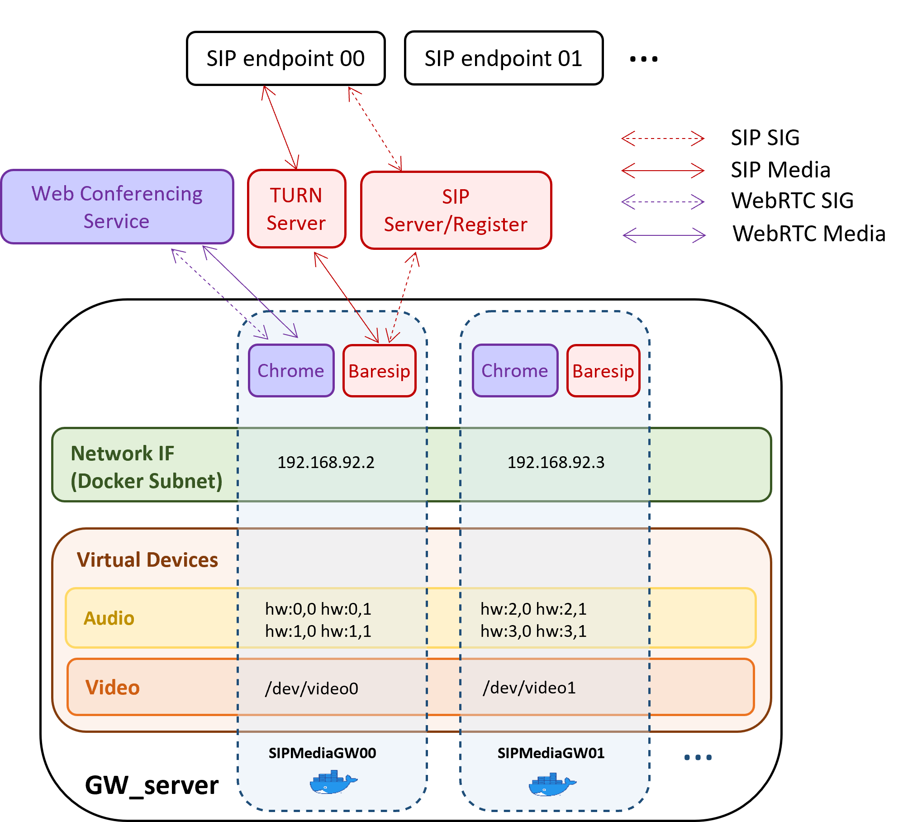

**SIPMediaGW** is a Docker based media gateway to be used on top of a web conferencing service (Jitsi Meet, BigBlueButton,...), in order to provide SIP (audio+video) access.

Environment
--------

### <a name="devices">Virtual video devices </a>
Example for 4 gateways, co-hosted on GW_server machine:

	sudo apt-get install v4l2loopback-utils
	echo "options v4l2loopback devices=4 exclusive_caps=1,1,1,1" | sudo tee  /etc/modprobe.d/v4l2loopback.conf
	echo "v4l2loopback" | sudo tee -a /etc/modules
	sudo modprobe v4l2loopback

### Docker network ### 

A user-defined bridge network to connect the gateways:

	docker network create  --subnet=192.168.92.0/29 gw_net

### SIP register and TURN server ###

To be accessible from any SIP endpoint, the gateway needs SIP registering facilities.
Kamailio is an open-source SIP server which can be easily installed.

To overcome NAT traversal issues, a TURN server acts as a media traffic relay. Coturn is an open-source STUN and TURN implementation.

Before starting the gateway, a local (docker based) testing environment (Kamailio and Coturn) may be simply started as follows:

	docker compose -f test/docker-compose.yml -p testing up -d --force-recreate

Usage
--------

Someone already connected to the webconference, e.g:

	google-chrome "https://rendez-vous.renater.fr/testmediagw"	

SIPMediaGW.sh is a helper script to automate gateway launching, is able to launch as many gateways (running in the same time) as possible, in accordance with *cpuCorePerGw* parameter value fixed in [sipmedia.cfg](https://github.com/Renater/SIPMediaGW/blob/main/sipmediagw.cfg).
 >	 **_NOTE:_** When running multiple gateways simultaneously, this script automatically check ressources availlability (assuming that all the CPU is dedicated to SIPMediaGW instances) but does not perform any [virtual video devices provisionning](#devices).

Launch a gateway:

	SIPMediaGW.sh -r testmediagw
 >    **_NOTE:_** "-r" (room) arguments is optional:
 if not passed, the SIP endpoint will connect first to an Interactive Voice Response (IVR). By default a 10 digits number is expected as a room name.
 
Once the gateway is running, the webconference can be joined by pushing a call directly to **sip:testmediagw@192.168.92.1**

Alternatively, HTTPLauncher.py provides a way to launch a gateway by sending an http request.

Start the http server:

	python HTTPLauncher.py

Launch a gateway:

	curl "http://192.168.92.1:8080/sipmediagw?room=testmediagw"

The gateway will automatically stop after the call is closed.

Implementation
-----------

- **entry_point.sh**

	Docker entry point (~ submodules launcher).

- **/src**

	Core functions implementation.

Configuration
-----------

- **/browsing**

	This directory contains browsing scripts (python/selenium) to enter in a room of a specific web conferencing service.

- **/baresip**

	Defaulf baresip configuration file used as a template configuration by the gateway.

- **<a name="config">sipmediagw.cfg</a>**

	Configuration file where to set: the SIP server address, a secret used by the gateways for SIP registration, TURN server address and credentials.

- **docker-compose.yml**

	The docker compose file.

Build
-----------
	docker image build -t renater/sipmediagw:test .

Troubleshoot
--------

Logs:

	tail -f /var/log/syslog | grep mediagw
	
Restart Audio:

	sudo  pulseaudio -k

Remove virtual devices:

	sudo modprobe -r v4l2loopback

