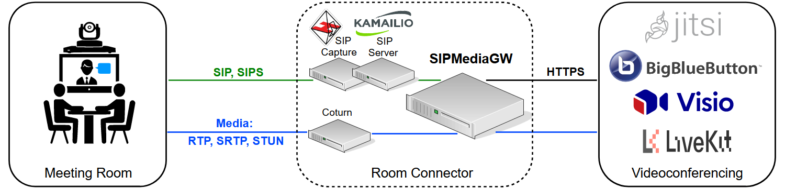
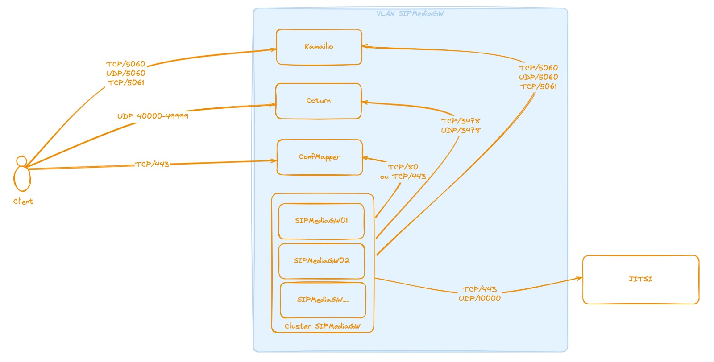

# SIPMediaGW
SIPMediaGW is a Docker-based set of open-source components that allow traditional video conferencing rooms to join Jitsi or Big Blue Button web conferences using SIP and RTP protocols.



The room connector is compatible with all video devices supporting the SIP protocol. It has been tested with major devices from Polycom, Cisco, Huawei, and Aver.

SIPMediaGW relies on several open-source projects such as [Coturn](https://github.com/coturn/coturn), [Kamailio](https://github.com/kamailio/kamailio), [Homer](https://github.com/sipcapture/homer), [Baresip](https://github.com/baresip/baresip), [FFmpeg](https://github.com/FFmpeg/FFmpeg), [Pulseaudio](https://github.com/pulseaudio/pulseaudio), [ALSA](https://github.com/alsa-project/alsa-lib), [Video4Linux](https://linuxtv.org/), [Fluxbox](http://www.fluxbox.org/).


## Features

- Audio and video support
- Inbound and outbound calls
- Encrypted SIP and RTP traffic
- Autoscaling logic for Cloud deployment
- Content sharing via BFCP (Binary Floor Control Protocol)
- Streaming capabilities via RTMP (Real-Time Messaging Protocol)

## Usage
### Installation
- [Development environment](./docs/install_dev_env.md) 
- [Production environment](./docs/install_prod_env.md)

After installation, ensure that your firewall permits the following network traffic :



### Testing 
Once the services are up and running, you can join a conference from your preferred SIP softphone.
Refer to the [testing section](./docs/testing.md) for more information.

### Troubleshooting 
The logs are handled by syslog of the host machine:
```
tail -f /var/log/syslog | grep mediagw
```

Inspect Kamailio database:
```
docker run -it --network=host --entrypoint mysql mysql -h 127.0.0.1 -u root -pdbrootpw kamailio -e "SELECT username, locked, to_stop FROM location"
```

For troubleshooting/monitoring purposes, real-time packet capture and visualization tools can be deployed as follows:

```
docker compose -f deploy/docker-compose.yml up -d --force-recreate heplify_server homer_webapp
```
**_NOTE:_**  Homer and SIP Capture tools are automatically deployed with the [Development environment](./docs/install_dev_env.md).

## Contributing

Contributions are always welcome.

1. Fork the repository and create your branch from `main`.
2. Open an issue to discuss proposed changes.
3. Make your changes and ensure tests pass.
4. Submit a pull request with a clear description of your changes.

## License

This project is licensed under the Apache 2.0 License. 
See the [LICENSE](LICENSE) file for details.
