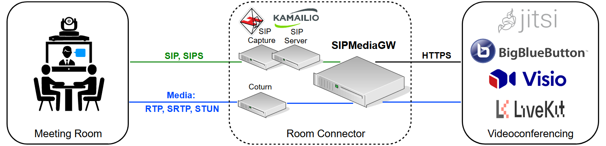

Overview
--------

**SIPMediaGW** is a Docker based media gateway to be used on top of a web conferencing service (Jitsi Meet, BigBlueButton,...), in order to provide SIP (audio+video) access.

The Room Connector can be easily deployed thanks to the "All-in-one" [vagrant file](https://github.com/Renater/SIPMediaGW/blob/main/test/Vagrantfile) (requires Vagrant and VirtualBox).\
To do so, simply run:

	VAGRANT_VAGRANTFILE=test/Vagrantfile vagrant up

Once the virtual machin is up, you can join a conference from your preferred SIP softphone:

- **sip:your_conference_name@192.168.75.13** (Direct access)
- **sip:0@192.168.75.13** (IVR access)

In order to do that, you can use Baresip thanks to the provided [testing environment](https://github.com/Renater/SIPMediaGW/tree/main/test/baresip):
	
	./test/baresip/SIPCall.sh -u sip:test@192.168.75.1 -d 0@192.168.75.13

Technical insights
--------
- Architecture: [SIPMediaGW in-depth](https://github.com/Renater/SIPMediaGW/blob/main/docs/sipmediagw-in-depth.md)
- Call flow: [SIPMediaGW call flow](https://github.com/Renater/SIPMediaGW/blob/main/docs/call_flow.md)
- BFCP: [Screen sharing from meeting room to web users](https://github.com/Renater/SIPMediaGW/blob/main/docs/BFCP.png)

