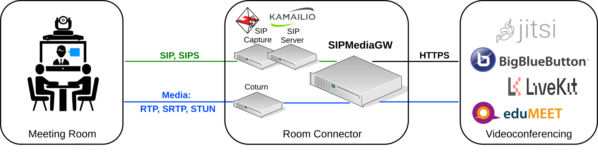

**SIPMediaGW** is a Docker based media gateway to be used on top of a web conferencing service (Jitsi Meet, BigBlueButton,...), in order to provide SIP (audio+video) access.

All-in-one (for **testing**) deployement of the "Room Connector" (requires vagrant+virtualbox):

	vagrant up

Once the virtual machin is up, join a conference from your preferred SIP softphone:

- **sip:0@192.168.75.13** (IVR access)
- **sip:your_conference_name@192.168.75.13** (Direct access)

Environment
--------

### Docker network ### 

A user-defined bridge network to connect the gateways:

	docker network create  --subnet=192.168.92.0/29 gw_net

### SIP register and TURN server ###

To be accessible from any SIP endpoint, the gateway needs SIP registering facilities.
Kamailio is an open-source SIP server which can be easily installed.

To overcome NAT traversal issues, a TURN server acts as a media traffic relay. Coturn is an open-source STUN and TURN implementation.

Before starting the gateway, a local (docker based) testing environment (Kamailio and Coturn) may be simply started as follows:

	docker compose -f test/docker-compose.yml -p testing up -d --force-recreate

Usage
--------

SIPMediaGW.sh is a helper script to automate gateway launching, is able to launch as many gateways (running in the same time) as possible, in accordance with CPU_PER_GW environment variable value.
 >	 **_NOTE:_** When running multiple gateways simultaneously, this script automatically check ressources availlability (assuming that all the CPU is dedicated to SIPMediaGW instances) but does not perform any [virtual video devices provisionning](#devices).

Launch a gateway:

	SIPMediaGW.sh -r testmediagw
 >    **_NOTE:_** "-r" (room) arguments is optional:
 if not passed, the SIP endpoint will connect first to an Interactive Voice Response (IVR). By default a 10 digits number is expected as a room name.

The gateway will automatically stop after the call is closed.

Troubleshoot
--------

Logs:

	tail -f /var/log/syslog | grep mediagw
	
Restart Audio:

	sudo  pulseaudio -k

Remove virtual devices:

	sudo modprobe -r v4l2loopback

