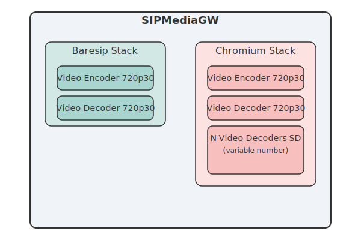

# CPU Consumption Analysis for Video Encoding/Decoding

This document provides CPU consumption metrics for video encoding and decoding processes.

CPU usage is measured for the two main application stacks: **baresip** (with software and GPU encoding/decoding options) and **Chromium** (software encoding/decoding only).

The following analysis presents CPU consumption metrics based on tests conducted using an **Outscale tinav5.c4r4p1 instance** for the CPU ([Outscale VM types](https://docs.outscale.com/fr/userguide/Types-de-VM.html)) and an **NVIDIA Pascal (P6) GPU**.

### Baresip

CPU consumption for the **baresip** stack is measured in two configurations:
1. **Software Encoding/Decoding**: The CPU handles all video encoding and decoding tasks.
2. **GPU Encoding/Decoding**: Video encoding and decoding tasks are offloaded to the GPU, reducing the CPU load.

### Chromium

For **Chromium**, video encoding and decoding are performed exclusively by the CPU. CPU consumption scales with the number of active participants in the video session.

### CPU Consumption Results (1 VCPU <=> 100%)

The tables below summarize the CPU consumption for **baresip** and **Chromium** in various scenarios.

#### Baresip CPU Consumption

| Configuration             | Average CPU Consumption |
|---------------------------|-------------------------|
| Software Encoding/Decoding| 65% / 15%               |
| GPU Encoding/Decoding     | 35% / 10%               |

#### Chromium CPU Consumption by Number of Participants

| Number of Participants    | Average CPU Consumption         |
|---------------------------|---------------------------------|
| 2 participants            | 80 %                            |
| 5 participants            | 110 %                           |
| 10 participants           | 160 %                           |
| 50 participants           | 200 %                           |
