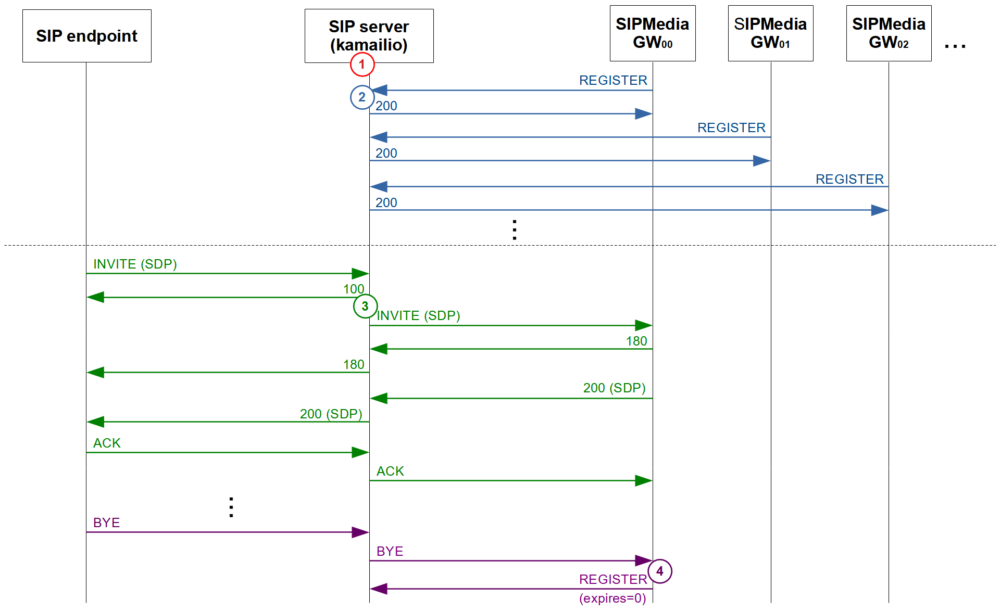

SIPMediaGW call flow
--------

1. SIP Server setting
   - [usrloc](https://github.com/Renater/SIPMediaGW/blob/109ecb386595e2842606bbff756fc54eb4882da2/test/kamailio/config/kamailio.cfg#L422-L429) and [dialog](https://github.com/Renater/SIPMediaGW/blob/109ecb386595e2842606bbff756fc54eb4882da2/test/kamailio/config/kamailio.cfg#L335-L339) modules in kamailio are configurated respectively with db_mode=3 and db_mode=1 \
   => any changes are reflected in the data base in realtime.
   -  The [minimum expires value](https://github.com/Renater/SIPMediaGW/blob/109ecb386595e2842606bbff756fc54eb4882da2/test/kamailio/config/kamailio.cfg#L423) of a "Contact" is set to 1 minute.
   Accordingly, the SIP register interval of a SIPMediaGW ([regint](https://github.com/Renater/SIPMediaGW/blob/114ee4be29e0460132a0c018b8bbd94c72728522/entrypoint.sh#L122)) is set to 1 minute.
   - The location table in Kamailio is customized with a new columun: ["locked"](https://github.com/Renater/SIPMediaGW/blob/114ee4be29e0460132a0c018b8bbd94c72728522/test/kamailio/kamailioRun.py#L22-L23), which indicates if a registered SIPMedaGW is accessible (or not).

2. SIPMediaGW registration
   - When starting, a gateway tries to register with the SIP Server.
   - The username follows this template: *{prefix}.[mediagw](https://github.com/Renater/SIPMediaGW/blob/109ecb386595e2842606bbff756fc54eb4882da2/test/.env_kamailio#L2).{id}*
     - "prefix" must be chosen such as to ensure that each username is unique from SIP Server side (e.g. [IP address](https://github.com/Renater/SIPMediaGW/blob/109ecb386595e2842606bbff756fc54eb4882da2/test/services/sipmediagw.service#L14) ot the host machine).
     - ["id"](https://github.com/Renater/SIPMediaGW/blob/114ee4be29e0460132a0c018b8bbd94c72728522/SIPMediaGW.sh#L36) suffix is automatically obtained when the gateways starts.
   - The  [challenge–response](https://github.com/Renater/SIPMediaGW/blob/114ee4be29e0460132a0c018b8bbd94c72728522/test/kamailio/config/kamailio.cfg#L822-L823) authentication only relies on a [shared secret](https://github.com/Renater/SIPMediaGW/blob/109ecb386595e2842606bbff756fc54eb4882da2/test/.env_kamailio#L1)
   - A newly registered gateway is referenced in the location table as unlocked (locked=0)

3. Incomming call

   - Thanks to a customized [routing logic](https://github.com/Renater/SIPMediaGW/blob/109ecb386595e2842606bbff756fc54eb4882da2/test/kamailio/config/request_gw.py#L60), the SIP Server selects a free (unlocked) SIPMediaGW to which the incoming call is forwarded.
   - The corresponding SIPMediaGW is locked until the end of the call.

4. Call ending
   - After receiving a BYE (end of the call) from the SIP Endpoint, the gateway turns off automatically.
   - The corresponding location in Kamailio is deleted
