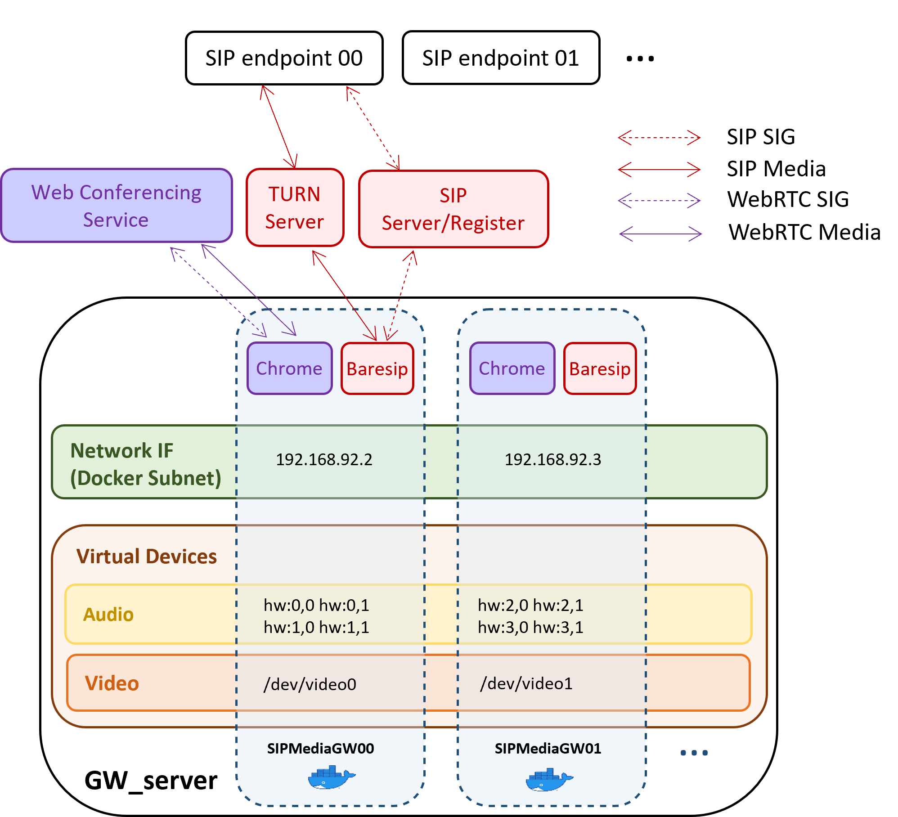

# Production environment for the SIPMediaGW

## Introduction


The SIPMediaGW consists of four main components: Kamailio, CoTURN, SIPMediaGW, and ConfMapper. These components can be installed on the same server or separated into virtual machines (VMs).




A production environment consists at least of 3 servers:
- Kamailio
- Coturn
- SIPMediaGW

> [!IMPORTANT]
> Please keep in mind that a SIPMediaGW server can only handle one SIP call at a time. Therefore, it is necessary to have multiple SIPMediaGW servers if you want to handle multiple simultaneous calls 

This is what a minimal production infrastructure looks like. In this architecture, the SIPMediaGW will handle one SIP call at a time.


You can run multiple SIPMediaGW instances on the same server, **but it is recommended to run one instance per server**.

## Common configuration
1. Create 3 Ubuntu or Debian servers (Kamailio, Coturn and SIPMediaGW)
2. Install [Docker](https://docs.docker.com/engine/install/)
3. Clone this repository on each one of them 
```
git clone https://github.com/Renater/SIPMediaGW /sipmediagw
```
## Kamailio
On the kamailio server, run the following tasks: 

1. Build Kamailio image and its database
   ```
   docker build -f /sipmediagw/deploy/kamailio/Dockerfile -t kamailio4sipmediagw /sipmediagw/deploy/kamailio
   docker compose -f /sipmediagw/deploy/docker-compose.yml pull sip_db
   ```
2. Add the following environment variables to `/etc/environment`
   ```
   HOST_IP=KAMAILIO_PRIVATE_IP
   PUBLIC_IP=KAMAILIO_PUBLIC_IP
   ```
3. Copy the service file in systemd folder
   ```
   sudo cp /sipmediagw/deploy/services/kamailio.service /etc/systemd/system
   ```
4. Enable and run kamailio service
   ```
   sudo systemctl enable kamailio.service
   sudo systemctl start kamailio.service
   ```

## Coturn
On the Coturn server, run the following tasks: 

1. Build Coturn image and its database
   ```
   docker build -f /sipmediagw/deploy/coturn/Dockerfile -t coturn4sipmediagw /sipmediagw/deploy/coturn
   ```
2. Add the following environment variables to `/etc/environment`
   ```
   HOST_IP=COTURN_PRIVATE_IP
   PUBLIC_IP=COTURN_PUBLIC_IP
   ```
3. Copy the service file in systemd folder
   ```
   sudo cp /sipmediagw/deploy/services/coturn.service /etc/systemd/system
   ```
4. Enable and run coturn service
   ```
   sudo systemctl enable coturn.service
   sudo systemctl start coturn.service
   ```

## SIPMediaGW
On the SIPMediaGW Server, run the following tasks:

1. Install **snd-aloop**, a Linux kernel module that provides a virtual sound card in loopback mode. It is primarily used for recording and audio streaming applications, allowing audio to be redirected from one application to another without the need for physical audio hardware : 
   ```
   sudo apt-get install -y linux-modules-extra-$(uname -r)
   echo "options snd-aloop enable=1,1 index=0,1" | sudo tee  /etc/modprobe.d/alsa-loopback.conf
   echo "snd-aloop" | sudo tee -a /etc/modules
   sudo modprobe snd-aloop
   ```

2. Install **v4l2loopback-dkms**, a Linux kernel module that creates video loopback devices. It allows the creation of virtual video devices that applications can use to send and receive video streams.
   ```
   sudo apt-get install -y v4l2loopback-dkms
   sudo echo "options v4l2loopback devices=1 exclusive_caps=1" | sudo tee  /etc/modprobe.d/v4l2loopback.conf
   sudo echo "v4l2loopback" | sudo tee -a /etc/modules
   sudo modprobe v4l2loopback
   ```

3. Create the network `gw_net` for the SIPMediaGW
   ```
   sudo docker network create --subnet=192.168.92.0/29 gw_net
   ```
   
4. Add the following environment variables to `/etc/environment`
   ```
   HOST_IP=SIPMEDIAGW_PRIVATE_IP
   SIP_REGISTRAR=KAMAILIO_PRIVATE_IP
   TURN_SRV=COTURN_PRIVATE_IP
   SIP_PROXY=KAMAILIO_PRIVATE_IP
   DOMAIN=WEBRTC_DOMAIN
   ```

5. Copy the service file in systemd folder
   ```
   sudo cp /sipmediagw/deploy/services/sipmediagw.service /etc/systemd/system
   ```

6. Enable and run sipmediagw service
   ```
   sudo systemctl enable sipmediagw.service
   sudo systemctl start sipmediagw.service
   ```


## Testing
To test the service, refer to [the testing section](./testing.md).