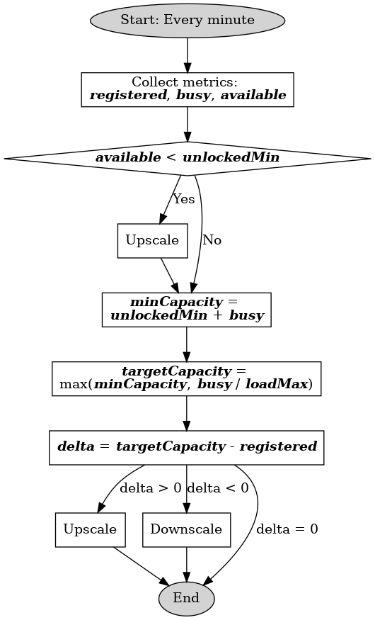

# SIPMediaGW Auto-Scaling Module

This document describes the auto-scaling mechanism used in the [SIPMediaGW project](https://github.com/Renater/SIPMediaGW), specifically the logic and configuration driving dynamic capacity management of SIPMediaGW instances.

---

## Overview

The auto-scaling system adjusts the number of SIPMediaGW virtual machines (VMs) based on real-time infrastructure load. It is executed every minute via a scheduled call (`scale.sh` script) and relies on metrics obtained from Kamailio’s database. The scaler logic is driven by configuration thresholds defined per hour of the day.

---

## 📈 Metrics Used

The scaling logic relies on the following values:

| Metric        | Description                                                                 |
|---------------|-----------------------------------------------------------------------------|
| **Registered** | Number of SIPMediaGW instances registered with Kamailio (total capacity)   |
| **Busy**       | Number of SIPMediaGW instances currently handling calls (active usage)     |
| **Available**  | Idle SIPMediaGW instances able to accept new calls = `Registered - Busy`   |
| **Running**    | Actual deployed CPU capacity (in vCPUs), used as a safeguard                |

If an instance is deployed ("running" state)  but not registered after 10 minutes, it is automatically terminated.

---

## ⚙️ Configuration

The scaling behavior is driven by thresholds defined in `scaler.json`, configurable by time slots.

| Parameter       | Description                                                                 |
|----------------|-----------------------------------------------------------------------------|
| `unlockedMin`   | Minimum number of **available** gateways before triggering scale-up         |
| `loadMax`       | Maximum allowed **usage ratio** (`busy / registered`) before scaling occurs |
| `cpu_per_gw`    | Number of vCPUs assigned per SIPMediaGW instance (typically 4)              |

---

##  Decision Flow

| Decision Steps | Diagram |
|----------------|---------|
|**1. Collect current metrics**: `available`, `busy`, `registered`  **2. Ensure Minimum Availability Buffer** - If `available < unlockedMin`, upscale to restore buffer.  **3. Compute Minimum Required Capacity** - `minCapacity = busy + unlockedMin`  **4. Determine Target Capacity** - `targetCapacity = max(minCapacity, busy / loadMax)`  **5. Adjust Deployment Accordingly** - If `targetCapacity > available`: upscale - If `targetCapacity < available`: downscale  |  |

---

## 📊 Example Scenarios

### ✅ Balanced Load (No Scaling Needed)
- `registered = 5`, `busy = 2`, `available = 3`
- `unlockedMin = 3`, `loadMax = 0.7`
- All conditions OK → no action

---

### 📈 Case 1: Scale-Up Due to Low Availability
- `registered = 5`, `busy = 4`, `available = 1`
- `unlockedMin = 3`
- 1 < 3 → scale-up by 2 instances (to ensure 3 are available)

---

### 📉 Case 2: Scale-Down Due to Low Utilization
- `registered = 6`, `busy = 2`, `available = 4`
- `unlockedMin = 2`, `loadMax = 0.5`
- Current usage = 2 / 6 = 0.33 → below loadMax
- Target capacity = max(2 + 2, 2 / 0.5) = 4
- If current = 6, delta = -2 → scale down by 2 instances

---

### 🚨 Case 3: Scale-Up Due to High Load
- `registered = 6`, `busy = 6`, `available = 0`
- `unlockedMin = 2`, `loadMax = 0.7`
- Usage = 100% → needs urgent upscale
- `minCapacity = 2 + 6 = 8`
- `targetCapacity = max(8, 6 / 0.7) ≈ 9`
- Scale up by 3 instances (12 vCPUs if 4 per GW)

---

### 🧯 Case 4: Instance Not Registered
- A new SIPMediaGW VM is deployed but not registered in Kamailio within 10 minutes
- It is considered broken and deleted automatically
- Ensures resilience and self-healing behavior

---

## Related Components

- `scale.sh`: Periodic trigger for scaling logic
- `scaler.json`: Time-based threshold configuration
- `Scaler.py`: Implements the scaling decision logic
- `kamailioGetLogs.py`: Extracts real-time metrics from Kamailio logs

